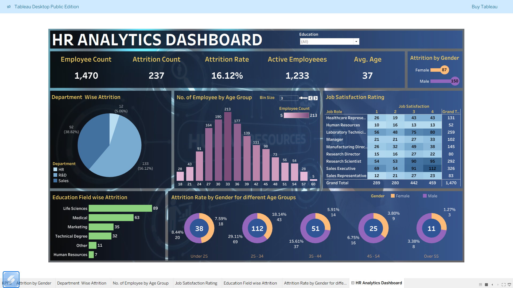

# HR Analytics Dashboard | Tableau

## 📌 Project Overview
This project presents an interactive HR Analytics Dashboard built using Tableau. It focuses on analyzing employee attrition and workforce distribution to uncover key trends and insights.

## 🎯 Project Objective
To analyze HR data and identify patterns related to employee attrition, demographics, job roles, and departmental distribution for data-driven HR decision-making.

## 📊 Key Insights
- Total employee count and attrition rate
- Attrition analysis by department, job role, and gender
- Employee distribution by age group and education field
- Interactive filters for deeper analysis

## 🛠 Tools & Technologies Used
- Tableau Public
- Data Visualization
- Excel

## 🔗 Live Dashboard
👉 https://public.tableau.com/app/profile/piyush.gupta7807/viz/HRDataProject_17544751973750/HRAnalyticsDashboard

## 📁 Dataset
The dataset used for this project is available in the repository as `HR Data.xlsx`.

## 📌 Key Learnings
- Hands-on experience with Tableau dashboard design
- Improved understanding of HR analytics metrics
- Practical exposure to data storytelling through visualization
